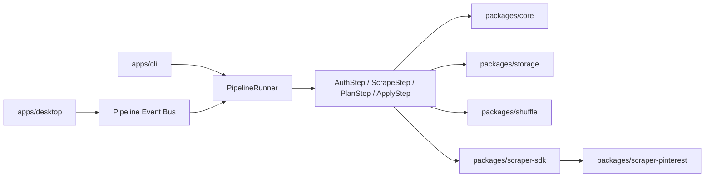

# PinShuffle v2 Architecture

## Architectural Critique

### What v1 did well

- Strict TypeScript in the original CLI
- Deterministic `planHash` protection around apply resume safety
- Practical diagnostics and screenshot capture
- A clear end-user concept: `init -> login -> scrape -> plan -> apply`

### What held v1 back

- Scraping, publishing, orchestration, persistence, and UX state all lived in single-purpose scripts
- Runtime state was spread across singleton root files, making concurrent jobs and recovery awkward
- Selector fallback logic existed, but there were no explicit DOM contracts guarding it
- Desktop UX depended on parsing CLI log text instead of consuming typed state
- There was no workspace/module boundary to help contributors reason about the system

## Proposed And Implemented v2 Layout



```text
apps/
  cli/
  desktop/
packages/
  core/
  pipeline/
  scraper-pinterest/
  scraper-sdk/
  shuffle/
  storage/
tests/
  unit/
  integration/
  contracts/
  smoke/
examples/
```

## Module Responsibilities

### `packages/core`

- Domain models like `PinRecord`, `ShufflePlan`, `JobRecord`, and `PipelineEvent`
- Runtime config schema with `zod`
- Service interfaces for auth, scraping, publishing, storage, and orchestration
- Shared error serialization and structured logger creation

### `packages/storage`

- `.pinshuffle/jobs/<jobId>/...` filesystem layout
- `JobRepository`, `CheckpointStore`, and `ArtifactStore`
- JSONL event persistence
- Compatibility mirrors for `config.json`, `pins.json`, `plan.json`, and `state.json`

### `packages/shuffle`

- Stable seed hashing
- Source fingerprinting
- Strategy registry:
  - `random`
  - `board-interleave`
  - `recency-balance`
  - `visual-cluster`

### `packages/scraper-sdk`

- Selector fallback resolution
- Retry/backoff policies
- Adaptive wait helpers
- Screenshot diagnostics primitives

### `packages/scraper-pinterest`

- Pinterest auth service
- Pinterest selector catalog
- `PinScraper.scrapeBoards()` implementation
- `BoardPublisher.publishPins()` implementation
- Selector doctor/contract surface

### `packages/pipeline`

- `PipelineRunner`
- `AuthStep`, `ScrapeStep`, `PlanStep`, `ApplyStep`
- Idempotent checkpoint-based execution
- Resume, dry-run, and cancellation handling

### `apps/cli`

- New command surface: `run`, `preview`, `doctor`
- Backward-compatible aliases for the v1 pipeline commands
- Event-streamed console feedback from the formal runner

### `apps/desktop`

- Electron shell on typed IPC
- Live progress cards and step visualization
- Recent jobs and recovery-aware reruns
- Direct access to config, auth, and diagnostics APIs

## Job Storage Model

Each job writes to:

```text
.pinshuffle/jobs/<jobId>/
  job.json
  checkpoints/
    auth-ready.json
    scrape-result.json
    shuffle-plan.json
    apply-state.json
  artifacts/
    pins.json
    plan.json
  logs/
    events.jsonl
  screenshots/
```

This makes the pipeline resumable and lets multiple runs coexist without stomping on one another.

## Pipeline State Machine

```text
created
  -> auth_ready
  -> scraping
  -> planned
  -> applying
  -> completed | failed | cancelled
```

Each step is designed to be idempotent:

- `auth`: writes an auth-ready checkpoint
- `scrape`: writes incremental artifacts plus a final scrape checkpoint
- `plan`: builds a deterministic plan from the scrape checkpoint
- `apply`: resumes from saved pin IDs and skips already-published pins

## Example Refactored Code

```ts
const runner = new PipelineRunner({
  authService: new PinterestAuthService(),
  pinScraper: new PinterestPinScraper(),
  boardPublisher: new PinterestBoardPublisher()
});

const result = await runner.run(config, {
  dryRun: false,
  resume: true
});
```

The important architectural shift is that CLI and desktop now orchestrate the same runner instead of implementing pipeline behavior themselves.

## Reliability Model

- Selector catalogs are separate from step orchestration
- Fallback resolution now budgets timeout across candidates instead of starving later selectors
- Publish retries use explicit backoff instead of ad-hoc loops
- Browser-side contract tests verify fixture HTML against the selector catalog
- Screenshot diagnostics are captured through the SDK primitives

## Testing Strategy

- Unit: config normalization and shuffle planner determinism
- Integration: pipeline runner end-to-end with fake auth/scraper/publisher services
- Contract: selector catalog against pinned HTML fixtures
- Smoke: dry-run pipeline artifacts and checkpoint creation

## Suggested Issues

1. Add richer board metadata extraction for strategy plugins and analytics.
2. Implement a true `ScrapeQueue` with adaptive concurrency and rate-limit backoff.
3. Add selector health snapshots from real Pinterest sessions to complement HTML fixtures.
4. Expand desktop recovery UX with “resume from selected job” and artifact inspection.
5. Add Windows/Linux packaging pipelines next to the macOS release workflow.
6. Introduce opt-in anonymized telemetry for selector failure rates.

## Suggested Pull Requests

1. `feat(workspace): introduce v2 monorepo packages and typed core contracts`
2. `feat(pipeline): add checkpointed PipelineRunner and legacy CLI compatibility`
3. `feat(scraper): extract Pinterest selector catalog, scraper SDK, and diagnostics`
4. `feat(desktop): replace CLI log parsing with typed IPC pipeline events`
5. `docs(oss): add architecture, roadmap, contributing, templates, and CI`
