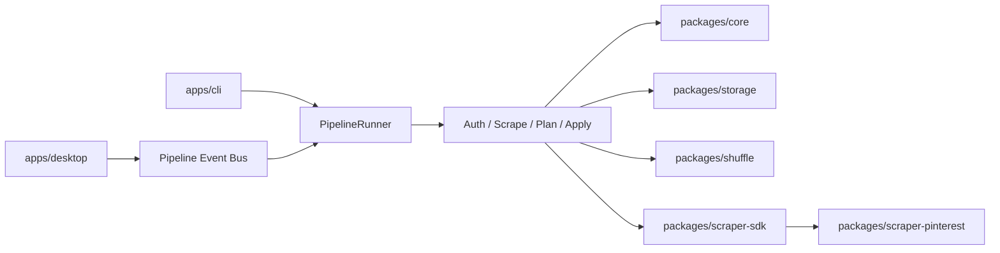

# PinShuffle

PinShuffle is a resumable Pinterest board shuffler for people who want to remix inspiration boards without manually re-saving pins one by one.

It uses headed Playwright automation instead of an official Pinterest API, builds a deterministic shuffle plan, and publishes pins through a formal job pipeline that can be resumed after failures.

## What It Does

- Scrapes one or more Pinterest boards into checkpointed job artifacts
- Builds a deterministic shuffle plan with strategy plugins
- Applies the plan to a destination board with retry and diagnostics support
- Streams pipeline events to both the CLI and the Electron desktop app
- Persists resumable jobs under `.pinshuffle/jobs/<jobId>/...`
- Keeps compatibility mirrors for `config.json`, `pins.json`, `plan.json`, and `state.json`

## Demo

- CLI: `pinshuffle run` streams `auth -> scrape -> plan -> apply` step progress in real time
- Desktop: the Electron app subscribes to the same typed event bus, showing live step state, recent jobs, cancellation, and recovery-aware reruns
- Artifacts: every job stores manifests, checkpoints, event logs, and screenshots in `.pinshuffle/jobs/<jobId>/`

## Architecture



- `packages/core`: domain models, config schema, service contracts, pipeline events
- `packages/storage`: filesystem jobs, checkpoints, artifacts, legacy file mirrors
- `packages/shuffle`: seed hashing, strategy registry, plan generation
- `packages/scraper-sdk`: selector fallback helpers, waits, retries, diagnostics primitives
- `packages/scraper-pinterest`: Pinterest auth, selector catalog, scraper, publisher, doctor
- `packages/pipeline`: formal job runner and idempotent pipeline steps
- `apps/cli`: new `run`, `preview`, `doctor` commands plus compatibility aliases
- `apps/desktop`: Electron shell using typed IPC instead of CLI log parsing

More detail lives in [ARCHITECTURE.md](/Users/joshuajohns/Documents/PinShuffle/ARCHITECTURE.md).

## Quick Start

1. Install dependencies:

```bash
npm install
npx playwright install chromium
```

2. Create a config:

```bash
npm run init -- \
  --source "https://www.pinterest.com/<user>/<board>/" \
  --destination "Shuffled Board - 2026-03-14" \
  --strategy board-interleave
```

3. Connect Pinterest:

```bash
npm run login
```

4. Preview or run the full pipeline:

```bash
npm run preview
npm run run
```

## CLI Usage

New commands:

```bash
pinshuffle run
pinshuffle preview
pinshuffle doctor
```

Compatibility aliases are still available:

```bash
pinshuffle init
pinshuffle login
pinshuffle auth-check
pinshuffle logout
pinshuffle scrape
pinshuffle plan
pinshuffle apply
pinshuffle diagnose
```

Examples:

```bash
pinshuffle run --no-resume
pinshuffle apply --resume --max 25
pinshuffle doctor --pin-url "https://www.pinterest.com/pin/<id>/"
```

## Desktop App

Launch the desktop shell:

```bash
npm run desktop
```

Desktop highlights:

- Live pipeline step visualization
- Typed progress events instead of CLI stdout scraping
- Recent job list with checkpoint-backed recovery
- Login checks, diagnostics, cancellation, and dry-run previews

## Testing

```bash
npm test
npm run test:contracts
npm run test:smoke
```

## Configuration

Validated with `zod`. Example configs live in [examples/config.random.json](/Users/joshuajohns/Documents/PinShuffle/examples/config.random.json) and [examples/config.interleave.json](/Users/joshuajohns/Documents/PinShuffle/examples/config.interleave.json).

## Contributing

Start with [CONTRIBUTING.md](/Users/joshuajohns/Documents/PinShuffle/CONTRIBUTING.md), then read [ROADMAP.md](/Users/joshuajohns/Documents/PinShuffle/ROADMAP.md) and [ARCHITECTURE.md](/Users/joshuajohns/Documents/PinShuffle/ARCHITECTURE.md) before opening a large PR.

## Safety Notes

- Pinterest UI automation is inherently brittle; selector contracts and diagnostics help, but upstream UI changes can still break flows.
- Use `preview` or `--dry-run` when validating new configs or selectors.
- Respect Pinterest rate limits and account safety boundaries.
